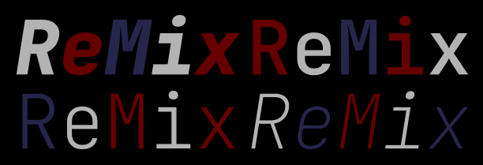

# ReMix - A Library for Reusable Transformers
ReMix is a powerful and user-friendly library that provides discreet comparators and mutators, 
allowing you to create reusable transformers for data transformations. 

With a focus on ease of use and developer experience, 
ReMix enables you to compose these components in a human-readable format, 
making your code more maintainable and understandable.

## Key Features

- **Intuitive API:** ReMix offers a clean and intuitive API that allows you to easily combine comparators and mutators to create powerful transformers.

- **Reusable Transformers:** Create modular and reusable transformers that can be shared across different projects, saving you development time and effort.

- **Discreet Comparators:** Fine-grained control over data comparison with a variety of discreet comparators supporting different data types and flexible comparison options.

- **Mutators:** Transform data using predefined rules with mutators that perform operations such as value modification, data formatting, and element filtering.

- **Human-Readable Format:** Express your transformations in a human-readable format with clear function and parameter names, consistent syntax, and documentation examples.

- **Error Handling and Validation:** Robust error handling and validation mechanisms provide informative error messages, ensuring your code is error-free and easy to debug.

- **Testing and Documentation:** Comprehensive testing and thorough documentation guides to help you get started quickly and leverage the library effectively.
